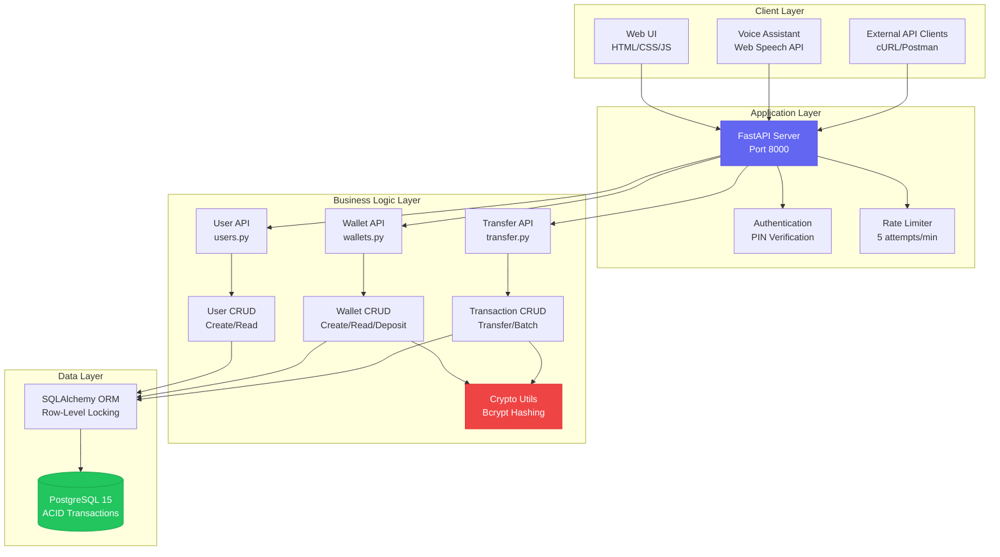
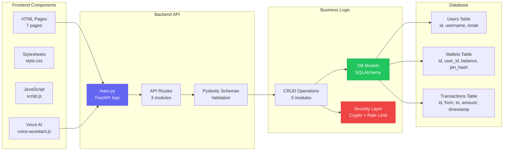
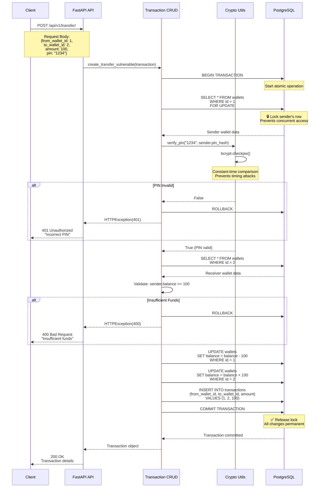
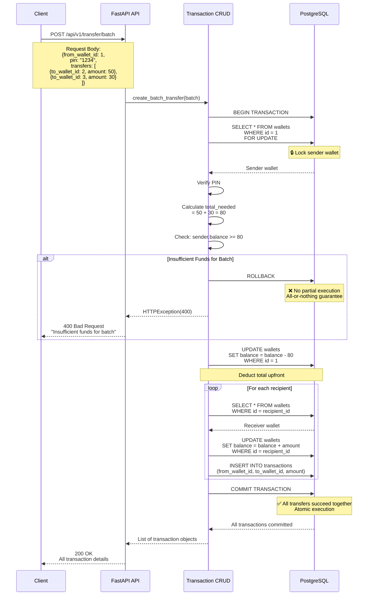
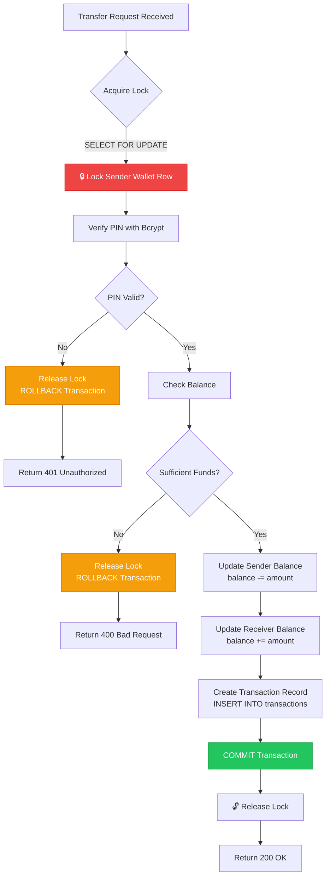
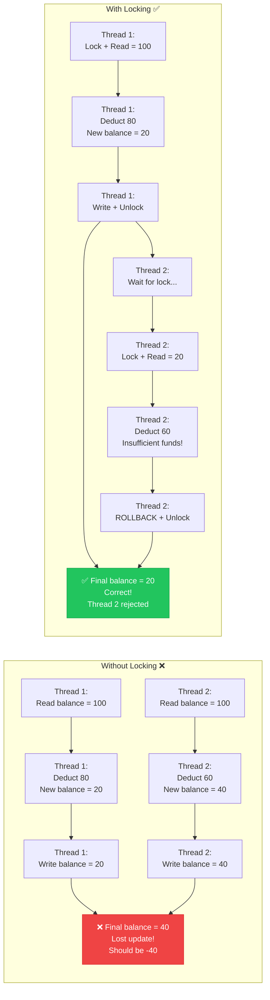
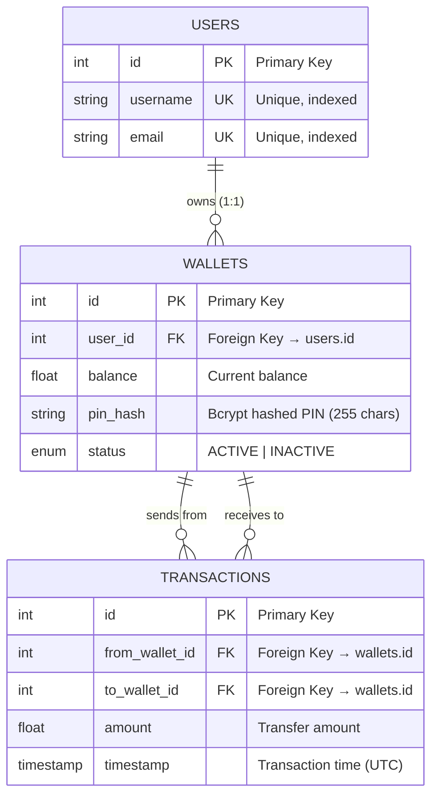

# Wallet Engine - Complete Technical Documentation
## Transaction Ordering & Execution System

**Problem Statement**: Modern transaction systems process multiple requests concurrently, where incorrect ordering and lack of atomic execution can lead to inconsistent system state and financial discrepancies.

**Solution**: A transaction ordering and execution engine that enforces atomic and consistent state transitions under concurrent access, enabling systematic validation and iterative hardening of transaction logic.

---

## Table of Contents
1. [System Architecture](#system-architecture)
2. [Component Architecture](#component-architecture)
3. [File Structure](#file-structure)
4. [Transaction Flow Diagrams](#transaction-flow-diagrams)
5. [Concurrency Control](#concurrency-control)
6. [Database Schema](#database-schema)
7. [Security Architecture](#security-architecture)
8. [AI Voice Assistant](#ai-voice-assistant)
9. [API Documentation](#api-documentation)

---

## System Architecture

### High-Level System Architecture



**Key Components**:
- **Client Layer**: Multiple interfaces (Web, Voice, API)
- **Application Layer**: FastAPI with security middleware
- **Business Logic**: Separated API routes and CRUD operations
- **Data Layer**: PostgreSQL with ORM for ACID compliance

---

## Component Architecture

### Detailed Component Interaction



---

## File Structure

### Complete Project Structure

```
builttobreak-master/
│
├── 📂 app/                                    # Backend Application
│   │
│   ├── 📂 api/                                # API Route Handlers
│   │   ├── __init__.py
│   │   ├── users.py                           # User Management Endpoints
│   │   │   └── POST /api/v1/users/           # Create user
│   │   │   └── GET  /api/v1/users/           # List users
│   │   │   └── GET  /api/v1/users/{id}       # Get user
│   │   │
│   │   ├── wallets.py                         # Wallet Operations Endpoints
│   │   │   └── POST /api/v1/wallets/         # Create wallet (with PIN)
│   │   │   └── GET  /api/v1/wallets/         # List wallets
│   │   │   └── GET  /api/v1/wallets/{id}     # Get wallet
│   │   │   └── POST /api/v1/wallets/deposit  # Deposit funds (PIN required)
│   │   │
│   │   └── transfer.py                        # Transfer Endpoints
│   │       └── POST /api/v1/transfer/        # Single transfer (PIN required)
│   │       └── POST /api/v1/transfer/batch   # Batch transfer (PIN required)
│   │       └── GET  /api/v1/transfer/transactions  # Transaction history
│   │
│   ├── 📂 core/                               # Core Utilities & Security
│   │   ├── __init__.py
│   │   ├── crypto.py                          # Cryptographic Functions
│   │   │   └── hash_pin()                    # Bcrypt PIN hashing
│   │   │   └── verify_pin()                  # Secure PIN verification
│   │   │   └── generate_secure_token()       # Token generation
│   │   │
│   │   ├── rate_limiter.py                    # Rate Limiting
│   │   │   └── limiter                       # SlowAPI limiter instance
│   │   │   └── PIN_VERIFY_LIMIT = 5/min      # Brute force protection
│   │   │
│   │   └── config.py                          # Configuration Settings
│   │
│   ├── 📂 crud/                               # Database CRUD Operations
│   │   ├── __init__.py
│   │   ├── user.py                            # User Database Operations
│   │   │   └── create_user()                 # Create new user
│   │   │   └── get_user()                    # Fetch user by ID
│   │   │   └── get_users()                   # List all users
│   │   │
│   │   ├── wallet.py                          # Wallet Database Operations
│   │   │   └── create_wallet()               # Create wallet (hash PIN)
│   │   │   └── get_wallet()                  # Fetch wallet by ID
│   │   │   └── verify_wallet_pin()           # Verify PIN (bcrypt)
│   │   │   └── deposit_wallet()              # Deposit with PIN check
│   │   │
│   │   └── transaction.py                     # Transaction Processing Logic
│   │       └── create_transfer_vulnerable()  # Single transfer with locking
│   │       └── create_batch_transfer()       # Atomic batch transfer
│   │       └── get_transactions()            # Fetch transaction history
│   │
│   ├── 📂 database/                           # Database Configuration
│   │   ├── __init__.py
│   │   ├── db.py                              # Database Connection & Session
│   │   │   └── engine                        # SQLAlchemy engine
│   │   │   └── SessionLocal                  # Session factory
│   │   │   └── get_db()                      # Dependency injection
│   │   │
│   │   └── models.py                          # SQLAlchemy Models
│   │       └── User                          # User model
│   │       └── Wallet                        # Wallet model (with pin_hash)
│   │       └── Transaction                   # Transaction model
│   │
│   ├── 📂 schemas/                            # Pydantic Schemas (Validation)
│   │   ├── __init__.py
│   │   ├── user.py                            # User Request/Response Schemas
│   │   │   └── UserCreate                    # Create user schema
│   │   │   └── User                          # User response schema
│   │   │
│   │   ├── wallet.py                          # Wallet Request/Response Schemas
│   │   │   └── WalletCreate                  # Create wallet schema
│   │   │   └── WalletDeposit                 # Deposit schema
│   │   │   └── Wallet                        # Wallet response schema
│   │   │
│   │   └── transaction.py                     # Transaction Schemas
│   │       └── TransactionCreate             # Single transfer schema
│   │       └── BatchTransferCreate           # Batch transfer schema
│   │       └── Transaction                   # Transaction response schema
│   │
│   └── main.py                                # FastAPI Application Entry Point
│       └── app = FastAPI()                   # FastAPI instance
│       └── API route includes                # Include all routers
│       └── Static file serving               # Serve UI files
│       └── HTML page routes                  # Serve HTML pages
│
├── 📂 ui/                                     # Frontend Files
│   ├── index.html                             # Dashboard Homepage
│   ├── users.html                             # User Management Page
│   ├── wallets.html                           # Wallet Management Page
│   ├── deposit.html                           # Deposit Funds Page
│   ├── transfer.html                          # Transfer Money Page
│   ├── balance.html                           # Balance Checking Page
│   ├── transactions.html                      # Transaction History Page
│   ├── voice-assistance.html                  # AI Voice Assistant Interface
│   ├── voice-assistant.js                     # Voice AI Logic & API Integration
│   │   └── VoiceAssistant class              # Main voice assistant class
│   │   └── Speech recognition                # Web Speech API integration
│   │   └── NLP command parsing               # Extract intent & parameters
│   │   └── API integration                   # Call backend endpoints
│   │   └── Text-to-speech                    # Voice responses
│   ├── script.js                              # General UI Interactions
│   └── style.css                              # Application Styling
│
├── 📂 tests/                                  # Test Suite
│   ├── __init__.py
│   └── test_failures.py                       # Concurrency & Race Condition Tests
│       └── Test double-spending              # Concurrent transfer tests
│       └── Test batch atomicity              # All-or-nothing validation
│
├── 📄 docker-compose.yml                      # Docker Orchestration
│   └── web service (FastAPI)                 # Application container
│   └── db service (PostgreSQL 15)            # Database container
│   └── volumes (postgres_data)               # Persistent storage
│
├── 📄 Dockerfile                              # Container Definition
│   └── Python 3.11 base image                # Base image
│   └── Install dependencies                  # pip install requirements
│   └── Copy application code                 # COPY app/ and ui/
│   └── Expose port 8000                      # API port
│
├── 📄 requirements.txt                        # Python Dependencies
│   └── fastapi==0.109.0                      # Web framework
│   └── sqlalchemy==2.0.25                    # ORM
│   └── psycopg2-binary==2.9.9                # PostgreSQL driver
│   └── bcrypt==4.1.2                         # PIN hashing
│   └── passlib[bcrypt]==1.7.4                # Password utilities
│   └── slowapi==0.1.9                        # Rate limiting
│
├── 📄 migrate_pins.py                         # Security Migration Script
│   └── Add pin_hash column                   # Schema update
│   └── Hash existing PINs                    # Data migration
│   └── Drop old pin column                   # Cleanup
│
├── 📄 README.md                               # Main Documentation
└── 📄 HACKATHON_SUBMISSION.md                 # Submission Document
```

---

## Transaction Flow Diagrams

### Single Transfer Flow (with Concurrency Control)



### Batch Transfer Flow (Atomic All-or-Nothing)



---

## Concurrency Control

### Locking Mechanism



### Race Condition Prevention



---

## Database Schema

### Entity Relationship Diagram



### Table Details

**USERS Table**:
- `id`: Auto-incrementing primary key
- `username`: Unique username, indexed for fast lookup
- `email`: Unique email address, indexed

**WALLETS Table**:
- `id`: Auto-incrementing primary key
- `user_id`: Foreign key to users table (one-to-one relationship)
- `balance`: Current wallet balance (float)
- `pin_hash`: Bcrypt hashed PIN (255 characters to store hash)
- `status`: Enum (ACTIVE/INACTIVE) for wallet state

**TRANSACTIONS Table**:
- `id`: Auto-incrementing primary key
- `from_wallet_id`: Foreign key to sender's wallet
- `to_wallet_id`: Foreign key to receiver's wallet
- `amount`: Transfer amount (float)
- `timestamp`: Transaction timestamp (auto-generated, UTC)

---


### Security Features

1. **Rate Limiting**
   - 5 PIN attempts per minute per IP
   - Prevents brute force attacks
   - Configurable limits

2. **PIN Hashing**
   - Bcrypt with automatic salting
   - Work factor: 12 (industry standard)
   - Never store plaintext PINs

3. **Secure Verification**
   - Constant-time comparison
   - Prevents timing attacks
   - Returns boolean only

4. **Transaction Locking**
   - Row-level database locks
   - Prevents race conditions
   - ACID compliance

---
## Summary

This documentation provides a complete technical overview of the Wallet Engine transaction ordering and execution system, addressing the hackathon problem statement through:

✅ **Atomic Execution**: All-or-nothing batch transfers  
✅ **Concurrency Control**: Database-level row locking  
✅ **Consistent State**: ACID-compliant transactions  
✅ **Security**: Bcrypt PIN hashing and rate limiting  
✅ **Innovation**: AI-powered voice interface  
✅ **Production Ready**: Docker deployment and comprehensive testing  
